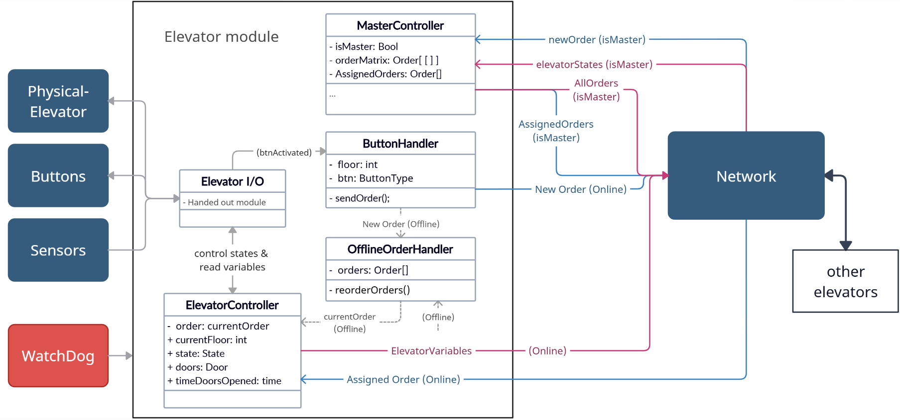

# Peer review - architecture overview and design choices

Need to include:
- Overall description of design choices 
- Top-down description of module_architecture
- Description of each module

### Design choices
The system is implemented as a UDP-based master-slave network. Every node can act as a master and is paired with a unique backup. Each elevator is identical, and resembles the following structure:

(Note that this is an old scetch and that module-names and internal variables has changed).

During normal mode of operation all elevators continously recieves all elevators State object as well as their new/completed orders when appropriate. These are stored in respectively the States and allOrders object, ensuring that all elevators have the opportunity to step in as master as any point. The master acts as any other elevator, but is also responsible for assigning orders to each elevator based on the information in States and allOrders. 

### Module Architecture & Threads
The proposed structure consists of the following modules:

